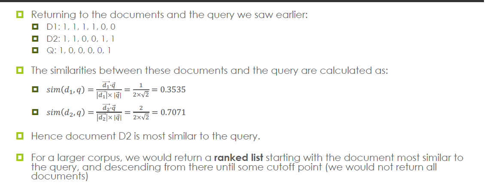

---
IR Note

---

> 课程编码：COMP3009J-Information Retrieval
>
> 考核形式：
>
> 授课教师：

# 00b-What is IR?

## 1. 什么是信息检索系统(Information Retrieval, IR)

信息检索（IR）主要解决用户通过查询，从大量信息中获取其感兴趣内容的问题。典型例子是搜索引擎（如Google、百度），它们可以从数十亿网页中筛选出最相关的内容呈现给用户。

**常见IR**

- Web Search Engines
- Desktop Search
- Mobile Search
- Library Search
- Searching Individual Web Sites

## 2. Information Items

**Document**

可以是：Books, video, images, etc.

## 3. Structured vs Unstructured Data

- **结构化数据**：如数据库或表格，支持数值范围、精确匹配等查询。tables
- **非结构化数据**：自由文本（如网页、文章），需用关键词或概念查询。free-form text written in natural language

> 现实中，大多数文档为**半结构化数据**，如网页包含标题、正文、链接等部分。

## 4. Representation

将文档以某种数学形式表示以支持检索，原因：

- 文本匹配效率低
- 计算机擅长数学计算

## 5. Storage, Organisation, Acceess

**存储与组织**：合理组织文档便于高效检索，尤其是在大规模文档集下。

**访问**：IR系统的核心目标是让用户能及时、有效地访问所需信息。

## 6. Information Need

User only use IR when there is some information that they are interested in reading.(用户仅在有信息需求时使用IR)

**Information Need 4 Stages:** (2024年考察, 2023年考察)

- Visceral Need: 未表达的模糊需求	（actual, but unexpressed)
- Conscious Need: 头脑中意识到的需求，难以清晰表达    
- Formalised Need: 可用自然语言表达的正式需求
- Compromised Need: 实际提交给IR系统的查询(query)

## 7. 查询的表达方式

- **Keyword-Based Querying:** 使用2-3个关键词查询
- **Context Queries:** 关注关键词在文档中的相对位置
- **Boolean Queries:** 使用AND、OR、NOT连接关键词
- **自然语言查询**：用完整句子表达
  - 现代搜索引擎（如ChatGPT、Siri）支持该方式，但理解能力有限

## 8. Role of IR

IR系统的任务是：

- 提供一组**相关文档**（通常按相关性排序）
- 用户需自行阅读获取知识

## 9. Why IR?

- **Information Overload**

## 10. Relevance

- satisfies the user's information need. （满足用户信息需求）
- Subjective 主观
- Remember that a query is just an expression of an information need. （只是Information need的表达，不一定时真实需求）

## 11. Evaluate

- Documents returns satisfy the information need.
- 用户是判断标准，但评估困难
- 构建测试集合+标准查询+专家判断文档是否相关

## 12. Related Research

1. **Question Answering (问答系统)**
2. **信息抽取（Information Extraction）**


# 01a-IR-Example: Boolean Queries

## 1. Boolean style query

> Brutus AND Caesar NOT Calpurnia

**第一种“朴素”做法**是逐行读取所有剧本：

- 筛选出同时包含“Brutus”和“Caesar”的剧本；
- 再排除包含“Calpurnia”的剧本。

**问题**：

- **Slow 效率低下**：对于大规模语料（corpus）非常缓慢。
- **Other operations not feasible 无法扩展**：不支持如“词项接近”之类的复杂操作。
- **Ranked retrieval not possible不能排序**：无法返回“最相关”的文档（无排名机制）。

## 2. Term-Document Incidence Matrix（词项-文档矩阵）

示例矩阵如下：

| Term      | A&C  | JC   | Tempest | Hamlet | Othello | Macbeth |
| --------- | ---- | ---- | ------- | ------ | ------- | ------- |
| Antony    | 1    | 1    | 0       | 0      | 0       | 1       |
| Brutus    | 1    | 1    | 0       | 1      | 0       | 0       |
| Caesar    | 1    | 1    | 0       | 1      | 1       | 1       |
| Calpurnia | 0    | 1    | 0       | 0      | 0       | 0       |
| Cleopatra | 1    | 0    | 0       | 0      | 0       | 0       |

> 每一列表示一个文档（剧本），每一行为一个词项。1 表示该剧本中包含该词项，0 表示不包含。

## 3. Incidence vectors
每个词项可以转化为一个“存在向量”：

- Brutus:  110100
- Caesar:  110111
- Calpurnia: 010000

这些二进制向量可用于后续布尔运算。

## 4. Operators

> Brutus AND Caesar NOT Calpurnia

1. **取反操作**（NOT Calpurnia）：

- 原向量： 010000
- 取反后： 101111

2. **位与操作**（AND）

   ```makefile
   Brutus:  110100  
   Caesar:  110111  
   NOT Calpurnia: 101111  
   →
   110100 AND 110111 AND 101111 = 100100
   ```

   

3. **解释结果**：1 表示相关的文档。对应的是第1和第4部剧本：

   - Antony and Cleopatra↳
   - Hamlet


## Bigger collections

假设我们有：

- N = 1,000,000 文档，每个包含约 1,000 个词；
- 每词平均6字节，总数据量 = 6GB；
- M = 500,000 个不同词项。

则 term-document matrix 大小为：

```
500,000 × 1,000,000 = 5×10^11 bits（即5000亿位）
```

然而实际上大部分值是0，因此该矩阵极度稀疏（sparse）


## Ambiguous Queries

即使是明确的查询词，也可能存在多种含义。例如：

- 查询词 "jaguar"：
  - 对某些用户是动物；
  - 对另一些用户是汽车品牌。
- 查询词 "bank"：
  - 河岸（river bank）；
  - 银行（financial institution）；
  - 飞机转弯动作（飞行术语）。

# 01b-Indexing

## 1. Introduction: Indexing

A data structure used to representation called index. The process of create index is called indexing.

## 2. Inverted Index（倒排索引）(2024年考察)

倒排索引是一种将每个词项（term）映射到其出现过的文档ID（docID）列表的结构。

- **Postings list**：每个 term 对应一个文档ID集合，称为 posting list；
- **Posting**：其中的一个元素，即一个文档ID；
- **Dictionary**：包含所有词项的有序列表；
- 列表通常按 docID 排序，方便后续操作（如合并、交集）。

## 3. Construction (2024年考察)

**Step 1：分词（Tokenisation）**

- To (token, docID)
- punctuation is removed
- convert to lowercase

**Step 2：排序（Sorting）**

- Sort by terms then by docIDs

**Step 3：构建字典和倒排列表**

- merge: a term appears more than once in a document
- Split into a dictionary and posting
- Also record **document frequency** of each term

## 4. Process Query

> Brutus AND Caesar

1. Locate Brutus and Caesar in the dictionary and retrieve its postings
2. Merge the 2 postings

## 5. 布尔操作 (2023年考察)

- AND(交集)： AND is used to narrow a search. More AND, Fewer records.
- OR(并集)： OR is used to broaden a search. Documents containing any number of the terms specified will be returned
- NOT(差集)： NOT is used to specifically exclude a term from search. More NOT, Fewer records.

## 6. Postings List 的合并（Merging）

**Intersection（交集）算法**

- 两个已排序的docID列表，从头到尾线性扫描
- 时间复杂度: O(x+y)

# 01c-Query Potimisation（2023考察）

> Brutus AND Calpurnia AND Caesar

正常步骤：For each of the terms, retrieve its posting list and merge with the others.

**优化：** Process in order of increasing frequency

- Start with the smallest set
- 原因：If we reach the end of shorter list, we can stop!

____

**更复杂的查询**

> (madding OR crowd) AND (ignoble OR strife)

- Get the frequency for all terms
- Estimate the size of each OR
- Process in increasing order of OR size

**Skip Pointer** 跳表优化

基本思路：

- Introduce skip poiner has a special type of pointer, it can reach later parts of list without interating through every element.

**Skip Poiner 的位置**

权衡(Tradeoff):

- More Skips --> shorter  skip spans but lots of comporisons to skip pointers.
- Fewer Skips --> few pointer comparison, but then long skip spans

**如果 postings list 长度为 L，建议插入 √L 个等间隔跳表**


# 02a-Preprocessing

## 1. Tokenisation(分词)

**基本概念**

- Token is an instance of a sequence of characters. **Not same with words**
- We get Token after futher processing

**Issues**

**“Finland’s capital”** → “Finland” 和 “’s” 应该合并吗？

**“Mercedes-Benz”** → 是一个词项还是两个？

**“state-of-the-art”** → 如何处理连字符？

**“San Francisco”** → 是一个词项还是两个？

## 2. language issues(2024考察)

**French**

L'ensemble -> one token or two?

**German**

Lebensversicherungsgesellschaftsangestellter

**Chinese/Japanese**

- No spaces between word.
- may be ambiguous
- multiple alphabets intermingled

**Arabic / Hebrew**

written right to left

## 3. Normalisation

same semantics but different forms into the same form.

**常见策略**

- Changing all tokens to lowercase
- Delete full stops
- Delete hyphens

## 4. Thesauri and Soundex（同义词与语音索引）

 **Thesaurus（词库）**

- 构建**同义词类等价词项**：（Synonyms, homonyms)
  - car = automobile↳
  - color = colour↳
- 可在文档中将“automobile”索引为“car-automobile”，或在查询中扩展。

**Soundex（语音索引）**

- 处理拼写错误的词项；
- 根据发音特征对词项分类，而非按拼写；
- 常用于人名匹配、语音搜索等场景。

# 02b-Stopwords, Stemming and Lemmatisation

**Stopword Removal**（停用词去除）

**Stemming**（词干提取）

**Lemmatisation**（词元还原）

## 1,. Stopword Removal（去除停用词）(2024年考察)

**定义**

- Stopword is a commonly occurring term that appears in so many documents that it does not add to the meaning of the document.
- the, of a, to
- Common appear in almost all document, and of little use when differentiating between documents

**为何去除**

- Reduce number of term
- Stopword Removal（去除停用词）

**使用 Zipf’s Law 辨识停用词：**

- Stopword can be estimated using Zipf's Law
- Only a few terms are used very often, more are used ont rarely
- 第2常用词频 ≈ 第1的½，第3常用 ≈ 第1的⅓，依此类推；

**权衡（Tradeoff）：**

- **好处**：samll space and little time；
- **风险**：可能去除语义重要的词，如：
  - “King of Denmark”
  - “To be or not to be”
  - “Flights to London”
- **Solution:**
  - Don's remove stopwords
  - Recognise when combinations of stopwords are meaningful, and include these as terms in the index.

## 2. Stemming （词干提取） (2024考察， 2023考察)

**定义**

Stemming is the process that maps terms to a common root.

Stemming is also known as suffix stripping

**Problems**

- **Overstemming**: sometimes suffixes can be removed from word that are not related
- **Homographs（同形异义词）**

## 3. Lemmatisation（词元还原）(2024考察, 2023考察)

**定义**

- Lemmatisation is a NLP technique for converting word into lemmas. (a reak word)
- Slower than stemming
- More accuracy

# 03a-Phrase Queries

Want to answer queries such as "stanford university" as phrase

## 1. Biword indexs (双词索引)

**基本思路**

- Index every consecutiive pair of terms(每两个连续单词) in the text as a phrase
- 例如：“Friends, Romans, Countrymen” 生成的 biwords 为：
  - friends romans
  - romans countrymen

**问题**

- False positives
- Index blowup due tob bigger dictionary

## Positional Indexes（位置索引）(2023年考察)

 **定义：**

位置索引在每个倒排记录中不仅记录文档ID，还记录**词项在文档中的位置**。

数据结构如下所示：

```
<term, number of docs;
 doc1: position1, position2, ...;
 doc2: position1, position2, ...;
 ... >
```

 **作用：**

通过词项出现的位置，可以判断两个或多个词项是否**连续**出现，从而支持任意长度的短语查询。

## 成本

**Positional Index**

- Expand postings storage
- A positional index is 2–4 times as large as a non-positional index.
- Positional index size 35–50% of volume of original text

# 03b-Vector-Space-Model-Introduction

## 1. Boolean Model 的缺点

- Either relevant or non-relevant to the query
- No partial match to query conditions lead to too few documents being retrieved.
- No Ranking

## 2. Introduction to Vector Space Model

**This model both documents and queries in an N-dimensional space**

>  VSM 将文档和查询表示为N-dimensional space

## 3. Vector Space Basis（向量空间的构建基础）

 **核心概念：Bag of Words（词袋模型）**

- 每个文档被视为一个词项集合（无序），忽略词序；
- 集合中每个**唯一词项**构成向量空间的一个维度 Each unique term in the collection is represented by a dimension in the vector space；
- 如果一个文档包含某个词项，该维度取值为对应的**权重（term weight）**；
- 若文档不包含某词项，该维度为 0；
- 最终通过向量之间的距离来计算相似度 similarity score。

## 4. Partial Matching and Ranking（部分匹配与排序）

**VSM facilitates partial matching by using non-binary term weights.**

$sim(q,d)$: 计算查询和文档的相似度得分

Returna ranked list of docs

## 5. Document and Query Representation

**示例语料：**

1. “**Information** **Retrieval** is an **exciting** **subject**”
2. “**Mathematics** is **important** in **Information** **Retrieval**”

 **去除停用词后提取的 6 个词项：**

- information
- retrieval
- exciting
- subject
- mathematics
- important

 **向量空间维度 = 6（每个词项一个维度）**

____


**Document Representation**

选取terms, 根据terms的数量决定向量的维度。

采用简化的权重方案：
$$
w_{i, j}= \begin{cases}1, & \text { if term } i \text { is in document } j \\ 0, & \text { otherwise }\end{cases}
$$

| Term        | Doc 1 | Doc 2 |
| ----------- | ----- | ----- |
| information | 1     | 1     |
| retrieval   | 1     | 1     |
| exciting    | 1     | 0     |
| subject     | 1     | 0     |
| mathematics | 0     | 1     |
| important   | 0     | 1     |


**说明：**所有文档向量都是 6 维的，未出现的词项取值为 0。

____


 **Query Representation**

> important information

(1, 0, 0, 0, 0, 1)

需要对应词表的顺序. Order of the terms in the vector is the same as corpus

## 03c-Vector-Space-Model-Cosine-Similarity

原理：The smaller the angle between two vectors, the more similar they are.
$$
\vec{a} \cdot \vec{b}=|\vec{a}||\vec{b}| \cos \theta
$$

## 1. Why Use Cosine Similarity?

**范围清晰**：因为所有权重非负（如 TF、TF-IDF），角度在 [0°, 90°]；

- 相似度最大（cos 0° = 1）：完全一致；
- 相似度最小（cos 90° = 0）：完全无关；

**易于计算和解释**；

**适用于稀疏向量**：实际文档向量维度极高（数万），但大部分为 0

## 2. Cosine Similarity

$$
\operatorname{sim}\left(d_j, q\right)=\frac{\vec{d}_j \cdot \vec{q}}{\left|\vec{d}_j\right||\vec{q}|}
$$

$$
\operatorname{sim}\left(d_j, q\right)=\frac{\sum_{i=1}^T w_{i, j} \cdot w_{i, q}}{\sqrt{\sum_{i=1}^T w_{i, j}^2} \cdot \sqrt{\sum_{i=1}^T w_{i, q}^2}}
$$

- T是语料库中不同词项的总数
- $w_{i,j}$: 词i 在文档j中的权重
- $w_{i,j}$: 词 i 在查询 q 中的权重



## 3. Some Questions

几个关键问题帮助实际实现：

- 若某 term 不在查询中，对相似度 **没有影响（乘积为 0）**；
- 若 term 不在文档中，也不会影响点积；
- 向量维度始终固定（词项总数），但实际为**稀疏表示**（sparse representation）；
- 实际中我们不显式存储完整向量，而使用倒排索引记录非零维度。

# 03d-Vector-Space-Model-Term-Weights

Term Frequency(TF)

Inverse Document Frequency(IDF)

## 1. Term  Frequency (TF)

The more frequently a term appears, the greater its importance to the document should be.

## 2. 为什么频率不能直接用

- A word that appears in every documents is not very useful.(类似stopwords)
- Long documents naturally contain more terms;

## 3. TF-IDF 权重模型

**TF (Term Frequency)**：

- 衡量某个词项在**当前文档中出现的频率**；
- 频率越高，代表该词对文档内容越重要。

**IDF (Inverse Document Frequency)**：

- 衡量某个词项在**整个文档集合中出现的稀有度**；
- 越少文档包含某词，说明它越有区分力 → 权重应更高。

$$
w_{i, j}=t f_{i, j} \cdot i d f_i
$$

## 4. Term Frequency（TF）公式

$$
t f_{i, j}=\frac{\text { freq }_{i, j}}{\max \text { freq }_j}
$$

其中：

- $freq_{i,j}$：词项 i在文档 j 中出现的次数；
- $\max freq_j$​：文档 j 中出现次数最多的词的频率。

目的：

- Ensure that terns in long documents do not get an unfair advantage

## 5. Inverse Document Frequency（IDF）公式

$$
i d f_i=\log \frac{N}{n_i}
$$

其中：

- $N$：整个文档集合中的文档总数；
- $n_i$：包含词项 $i$ 的文档数。

目的：

- Give a higher weight to terms that are rare


## **6：TF-IDF 权重**

$$
w_{i, j}=t f_{i, j} \cdot i d f_i
$$

**每个词项在每个文档中的权重都是唯一的**，因 TF 随文档而变，IDF 仅随词项在整个集合中的分布而变。

# 03e-Vector_Space_Model_Conclusions

## **1. TF-IDF Advantages:**

- TF gives more influence to a document that contains many occurrences of a particular term
- IDF lessens the impact of terms that appear very often in the collection.

## 2. 向量空间模型的优缺点

Advantages:

- Term weighting can improve retrieval performance
- Partial matching strategy allows for retrieval of documents taht match part of the query
- consine similarity can be used to return ranked list of docs

Disadvantages:

- Assumption terms are independent, which sometimes harm performance


##3.  **向量空间模型的实现步骤（Implementation）**

1. **读取文档（Read in documents）**
2. **分词（Tokenisation）**
3. **去除停用词（Stopword Removal）**
4. **词干提取（Stemming）**
5. **加入索引结构（Add to index）**
6. **计算 TF-IDF 权重**
   - 每个词项具有一个 IDF 值（全局）；
   - 每个文档中每个词项有自己的 TF 值（局部）。
7. **接收查询（Receive query）**
8. **返回查询结果（Retrieve results）**

该流程构成了现代 IR 系统基于向量空间模型的标准处理框架。

# 08a Fusion

## 1. 为什么研究Fusion

   - IR算法多而复杂
   - 将**多套检索系统**（或多种算法）对同一查询返回的结果整合成**单一的排序列表**，期望整体质量优于任一输入列表。
   - 召回率和精确率好

## 2. 应用场景
   - Metasearch
   - Distributed IR
   - Internal Metasearch: 许多算法对同一文档进行搜索

## 3. **Corpus Overlap** ：索引重叠程度与策略

1. **Disjoint databases**（完全不重叠）
   - 只可能出现在一个结果集中
   - 又称 *Collection Fusion*，常见于 Distributed IR↳
2. **Identical databases**（完全相同）↳
   - 文档频繁出现在多个列表
   - 重点依赖“多个系统同时认同”这一信号 → **Data Fusion**（本文主角）08a-Fusion-Introduction08a-Fusion-Introduction
3. **Overlapping databases**（部分重叠）↳
   - 既有独占文档，也有公共文档
   - 判断“没出现”是“真的不相关”还是“系统没收录”会变得棘手08a-Fusion-Introduction08a-Fusion-Introduction

**提示：** 决定融合策略前，必须先弄清各系统索引的相似度 —— 影响“合唱效应”（见下）权重。

## 4. 三大经典“效应” (Effects)

1. ### Skimming Effect

   “好系统把相关文档排在前面” → 只要**截取各列表前 N 条**再融合，常能显著提升效果。所有主流算法都默认利用它08a-Fusion-Introduction08a-Fusion-Introduction。

2. ### Chorus Effect

   如果**多个系统同时**把某文档排得很靠前（或至少都返回），那是“相关性”的强佐证，应给出更高融合得分。示例中 d5 被两系统同时排前二，优先级自然高于只被一个系统看好的 d19

   - 在**完全相同索引**场景最有效；在 Disjoint 场景完全无用。

3. ### Dark Horse Effect

   某个系统质量异常高或低，可能值得单独信赖或忽略。但**难以自动侦测**，多数融合算法不会显式利用

## 5. **Data Fusion 算法三大类*

1. **Rank-based Fusion**
   - 代表：**CombSUM (取倒数排名和)**、**BordaFuse** 等
   - 只依靠名次，简单易用；常伴随“投票”思想。
2. **Score-based Fusion**
   - 代表：**CombMNZ（归一化分数求和并乘出现次数）**、**ProbFuse**
   - 需把不同系统的原始分数做归一化处理。
3. **Segment-based Fusion**
   - 代表：**SlideFuse**、**Rank-Biased Precision Fusion**↳
   - 将列表划段后分配权重，兼顾 Skimming 与位置鲁棒性。

# 08-b Rank-Based Fusion

## 1. Rank-Based Fusion 概览

> “只看名次，不看分数”

- **动机**：在很多检索系统（尤其早期 TREC 评测）里，原始相关性分数的尺度各异，甚至不可获取；此时最稳妥的做法就是只利用**排名位置信息**。
- **基本思路**：为每篇文档 d 设计某种 *rank-score*，它只依赖 d 在各输入列表中的名次（或是否出现），然后把分数相加/加权后重新排序。
- **与三大效应的关系**
  - *Skimming*：越靠前的名次给越高权重。
  - *Chorus*：同一文档若出现在多个列表，会多次累加分数。
  - *Dark Horse*：纯基于名次无法识别“黑马系统”，需另加权重才行。

## 2  Interleaving（轮盘交叉）

| **步骤**                                                     | **说明**          |
| ------------------------------------------------------------ | ----------------- |
| ① 取所有输入列表的指针指向 *rank = 1*                        |                   |
| ② 依次从每个列表挑选当前指针所指的首个“未出现在结果中的文档”，追加到融合列表 | 形成“Round Robin” |
| ③ 将该列表指针后移一位，重复②，直到达到预设深度或所有列表耗尽 |                   |


- **示例**：PPT 中两套系统 A/B 的前十名经过轮盘交叉后得到<br>`d19 → d5 → d14 → d20 → d4 → d7 → d1 → d12 …`
- **优点**：实现极简，无需任何预处理或归一化。
- **缺点**：
  1. ***质量同权假设***——默认所有系统同样可靠，高质量列表会被低质量结果“稀释”；
  2. **缺少梯度**——rank 1 与 rank 10 得到的“轮次”权重一样，无法充分利用 Skimming；
  3. **可扩展性差**——系统数目 m 增大时，一次只选 m 篇文档，覆盖深度慢。
- **适用场景**：教学 demo、无法获得任何系统统计信息时的 baseline；生产环境少见。

## 3 Borda-Fuse（Borda 计数）

### 3.1 算法原理

- 源自 18 世纪法籍数学家 **Jean-Charles de Borda** 提出的“多候选少选民”投票法。
- **定义**：
  - 假设一共有 **c** 个不重复的文档（候选人）。
  - 在某个输入系统中，排第 *r* 的文档得 **c − r + 1** 分；未被排到的文档，把该系统剩余分数平均分给它们（公平处理“缺席”）。
  - 融合得分 = 各系统分数求和；再按降序输出。

### 3.2 计算示例

- 示例中 **c = 14**；System A 自身排了 10 篇文档，所以给没出现的 4 篇文档平均 **2.5 分**，System B 则给 **3.5 分**。

- 计算后前五名为

  ```
  d5 (27)  >  d14 (23)  >  d1 (18)  >  d19 (17.5)  >  d12 (15.5)
  ```

  相比 Interleaving，d5/d14 跃升至榜首，体现了 **Chorus Effect**（两系统共同高排）。

### 3.3 优劣分析

| 优点                                                         | 缺点                                                         |
| ------------------------------------------------------------ | ------------------------------------------------------------ |
| 1. 充分区分名次梯度； 2. 对“缺席文档”有平滑策略，避免 0/1 断层； 3. 实现仍然简单，只需遍历一次列表。 | 1. 平均分策略较为武断，可能高估从未出现过的文档； 2. 当列表深度不同、c 很大时，未出现文档占比高，平滑噪声多； 3. 同样默认系统等权，需要外部调权（Weighted Borda）。 |

## 4 | Reciprocal Rank Fusion (RRF)

### 4.1 核心公式

给定参数 **k（默认 60）**：
$$
\operatorname{RRF}_{\text {score }}(d)=\sum_{r \in R} \frac{1}{k+\operatorname{rank}_r(d)}
$$

- 若文档 d 不在结果 r 中，则该项记 0；此举天然支持*Skimming*（rank 越靠前分母越小）。
- 由于分数永远 ≤ 1/k，多个结果列表累加时，不会出现极端爆分。

### 4.2 快速估算

- rank=1 时得分 ≈ 0.0164；rank=10 时 ≈ 0.0143，衰减非常缓和——**鼓励召回**，同时又不会让深排文档翻盘。列表越多，同排位得分可线性叠加。

### 4.3 示例 & 现象

- 两系统样例中，d5/d14/d1 均出现在双列表前 7 位，因此累加后稳居前三：

  ```
  d5 (0.0325) > d14 (0.0315) > d1 (0.0303)
  ```

- **稳健性**：RRF 对系统多少、列表深度、rank 抖动都不敏感，被大量工业与学术检索管线采纳（如 TREC Deep Learning Task 里的官方 baseline）。

### 4.4 优劣对照

| 优点                                                         | 缺点                                                         |
| ------------------------------------------------------------ | ------------------------------------------------------------ |
| 1. 仅依 rank，零依赖归一化； 2. 单调递减、上界有限，易于解释； 3. 实验中常与学习-to-rank旗鼓相当（甚至更好）。 | 1. k 固定 60 虽经验有效，但不同场景若严重不匹配列表长度，也需调参； 2. 系统等权；若存在明显高低质量差异，仍需加权或先挑系统。 |

## 5 | 其它 Rank-Based 变体

| 方法                      | 关键思想                                          | 适用场景               |
| ------------------------- | ------------------------------------------------- | ---------------------- |
| **Weighted Interleaving** | 先用历史评测给各系统打权重，轮次按权重抽样        | A/B test、在线学习     |
| **Condorcet-Fuse**        | 用“成对胜率”替代 Borda 计数，找出群体更偏好的文档 | 投票理论深入、系统数多 |
| **Weighted Borda**        | Borda 分数再乘系统权重                            | 简单升级，易落地       |

> 这些方法的共同点：**先获取或估计系统性能** → **将好系统信号放大**，以抵御 Dark Horse Effect。

# 09a Fusion: Score-Based

> **Score-Based Fusion** 指的是使用多个信息检索系统（IR systems）返回的文档“得分”来进行结果合并与排序的融合方法。

## CombSUM 算法

📌 定义（Definition）

> **CombSUM** 是 Fox & Shaw 在 1994 年提出的一种经典的分数融合方法。

它的做法是：

- **对每个文档在各个 IR 系统中的得分进行求和**，作为最终的融合得分（fused score）。

🎯 公式：

ScoreCombSUM(d)=∑s∈Sscores(d)\text{Score}_{\text{CombSUM}}(d) = \sum_{s \in S} \text{score}_s(d)ScoreCombSUM(d)=∑s∈Sscores(d)

- SSS：所有参与融合的系统集合
- scores(d)\text{score}_s(d)scores(d)：系统 s 给文档 d 的得分

📌 优点：

- 利用了 **Skimming Effect**（顶部文档更可能相关）
- 也体现了 **Chorus Effect**（多系统一致认为相关的文档得分更高）

✅ 示例：

- System A: 0.45
- System B: 0.3
- System C: 0.35
- CombSUM Score = 1.1

分数归一化（Score Normalisation）

不同的系统可能给出的得分**分布范围不同**，比如：

- System A：分数在 0 到 1000 之间
- System B：分数在 0 到 1 之间

这种情况下不能直接加分数，需要统一标准。

🔧 标准归一化公式：


归一化后：

- 最佳排名文档得 1
- 最差排名文档得 0

归一化后才进行 CombSUM。

## CombMNZ 算法

定义：

**CombMNZ（Multiply by Non-Zero）** 是 CombSUM 的改进版本，用于更加强化 Chorus Effect。

做法：

在 CombSUM 的基础上，**乘以该文档出现在多少个结果集中（即非零得分次数）**。

示例：

- 系统 A: 0.45，系统 B: 0.3，系统 C: 0.35
- CombSUM = 1.1，出现 3 次 → CombMNZ = 3.3

## Linear Combination Model（线性加权模型）

❗ 问题：

CombSUM/CombMNZ 默认每个系统质量相同。但现实中有些系统搜索效果好，有些差。

📌 定义：

为每个系统分配一个**权重（weight）**，然后再加权求和。

ScoreLinear(d)=∑s∈Sws⋅normalised_scores(d)\text{Score}_{\text{Linear}}(d) = \sum_{s \in S} w_s \cdot \text{normalised\_score}_s(d)ScoreLinear(d)=s∈S∑ws⋅normalised_scores(d)

✅ 示例：

System A, B, C 权重分别为 1, 2, 3

- Scores: 0.45, 0.3, 0.35
- 总得分 = 0.45×1+0.3×2+0.35×3=2.10.45 $\times$ 1 + 0.3$\times$ 2 + 0.35 $\times$ 3 = 2.10.45×1+0.3×2+0.35×3=2.1

如何决定系统权重？

1. **CORI algorithm**：需要了解每个系统所使用的文档集的详细信息，基于文档频率和集合频率等信息计算。
2. **LMS**（Length-based Merging Score）：依据结果集的长度来决定权重，结果集越长权重越大（在实践中效果居然不错）。

# 09b Fusion-Probability-Based

**基本动机：为什么要引入概率融合（Probabilistic Fusion）**

传统 Score-Based 融合方法（如 CombSUM、CombMNZ）存在两个限制：

1. **对所有系统一视同仁**，即假设每个系统的表现一致。
2. **只看分数，不考虑位置表现**，忽视了某些系统可能“前几名文档质量特别高”而后续较差的特点。

因此，我们需要：

> 使用历史训练数据来学习“每个系统在每个位置段（segment）返回文档相关性的概率”，并据此打分。

## ProbFuse 算法

- 将每个结果集合（result set）划分为若干个**等大小的段（segments）**，编号为 k=1,2,…,x。

- 对于系统返回文档在第 k 段的位置，预先计算它“被相关”的概率。

- 最终打分 = 各系统对文档分配的概率值之和（考虑 Skimming + Chorus Effect）

**ProbFuse 的两个阶段**

1. 训练阶段（Training Phase）

基于一组有标注的查询历史，计算每个系统在每个 segment 中返回相关文档的概率：
$$
P_k=\frac{\text { segment } k \text { 中相关文档数量 }}{\text { segment } k \text { 的总文档数 }} \text {, 对所有训练查询求平均 }
$$
示例（x = 4 段）：

| Segment k | 训练查询1 | 训练查询2 | 训练查询3 | 平均概率 |
| --------- | --------- | --------- | --------- | -------- |
| k=1       | 3/3       | 2/3       | 1/3       | 0.67     |
| k=2       | 2/3       | 1/3       | 1/3       | 0.44     |
| k=3       | 1/3       | 1/3       | 0/3       | 0.22     |
| k=4       | 0/3       | 0/3       | 1/3       | 0.11     |


------

2. 融合阶段（Fusion Phase）

对于每条文档：

- 查看它在每个系统中的位置，属于第 k 段
- 获取训练阶段中该系统该段对应的概率 $P_k$
- 为了利用 Skimming Effect，分数 = $\frac{P_k}{k}$
- 对所有系统求和，作为最终得分

$$
\operatorname{Final} \operatorname{Score}(d)=\sum_{\text {systems }} \frac{P_k}{k}
$$

## SegFuse 算法（改进1：可变段宽）

**动机**

ProbFuse 的固定分段忽略了“前几个文档极可能相关”的现象。例如：

- 第1段40篇文档中，排第1位和排第40位的文档被一视同仁。

**SegFuse 核心思想：**

- **使用非均等宽度的段（段数少，越往后越宽）**
- 每段宽度：Sizek=10×2k−1−5\text{Size}_k = 10 \times 2^{k-1} - 5Sizek=10×2k−1−5
  - k=1 → 5
  - k=2 → 15
  - k=3 → 35
  - k=4 → 75
  - …

打分方式：

- 每个文档所在段的概率 × 文档的标准化位置分数（normalised score）

这比 ProbFuse 的 Pkk\frac{P_k}{k}kPk 更细粒度地强调了**位置信息的重要性**。

## SlideFuse 算法（改进2：滑动窗口）

**动机**

SegFuse 虽改进了段宽，但仍然存在“相邻文档分数差异巨大”的问题。

**例子：**

- 文档40 与文档41 属于不同段，分数断崖式下降。

**SlideFuse 核心思想：**

- 不使用分段，而是**每个文档的打分由其位置周围的滑动窗口（sliding window）计算得出概率**。
- 平滑掉锯齿状的分布，使相邻位置得分更合理。

**实现：**

- 在训练阶段计算每个 rank 的相关概率
- 在融合阶段：每个文档使用自己 rank 周围的滑动窗口的概率平均值

# 10-PageRank

## 1. Introduction

传统的排名模型（如 Vector Space、BM25）仅仅基于**单个文档的内容**进行计算，而没有考虑文档之间的关系。

> 这与人类判断文档重要性的方法不同：人类会参考其他文档对它的引用。

为此，**Learning to Rank** 提出引入其它“特征”，如文档的“重要性”（importance）。PageRank 就是衡量网页重要性的一种方式。

## 2. 文档重要性与引用（Document Importance）

学术中通常用被引用次数（citation count）来衡量论文的影响力。类似的思想也适用于网页：

- 网页之间存在超链接（hyperlinks）；
- 如果某个网页被很多其他网页链接（backlink），则说明它很“重要”。

## 3. 网页与引用计数的异同

- 📚 学术引用是**单向的**：A只能引用已发表的B；
- 🌐 网页引用可能是**双向的**（循环引用/circular references）；
- 学术引用有质量审核（peer review），网页没有；
- 因此，网络中的链接更容易被“作弊”（link farms等）。

## 4. PageRank 的核心思想

由谷歌创始人 Sergey Brin 和 Larry Page 在 1998 年提出。

基本公式如下：
$$
R(u)=\sum_{v \in B_u} \frac{R(v)}{N_v}
$$
$R(u)$ ：页面u的PageRank；
$B_u$ ：所有指向 u 的页面集合（backlinks）；
$R(v)$ ：页面 v 的PageRank；
$N_v$ ：页面v的出链数量（outlinks）。

解释：页面v将自己的PageRank平均分给它指向的每一个页面。

**初始值与迭代**

- 初始时给所有页面一个相同的PageRank（如1）；
- 每轮迭代根据公式计算新值，直到收敛（数值变化很小）；
- Brin & Page实验中，数据量为3.22亿链接，52次迭代收敛。

## 5. Rank Sink 问题与 Damping Factor 阻尼因子

**问题**：如果若干页面只互相链接，不指向外部，它们的PageRank会不断增长，形成“Rank Sink”。

**解决方法**：引入阻尼因子 ddd，通常取值为0.85：
$$
R(u)=(1-d)+d \cdot \sum_{v \in B_u} \frac{R(v)}{N_v}
$$

- $1−d$：表示“随机跳转”到任一页面的概率；
- 保证所有页面都有最小PageRank，不至于为零。

## 6. 没有Backlink的页面怎么办

旧公式下，没有backlink的页面PageRank为0，且不会传递任何权重。
 新公式通过 1−d1-d1−d 保证即使没有引用也有最低PageRank值。

## 7. PageRank 的实际意义与影响

- PageRank 成为 Google 搜索成功的关键因素之一；
- 现代搜索引擎融合了多个排序信号（如全文匹配、标题、近似度等）；
- PageRank 仍被用于搜索排序的一部分（但实现细节保密）。

# 11a-Relevance Feedback

## 1. 概念： Relevance Feedback（相关反馈）

**Relevance Feedback** 是指：用户参与到信息检索过程，通过对初始返回结果中哪些是“相关”（relevant）、哪些是“不相关”（non-relevant）的文档进行标注，从而帮助系统“重新理解”用户的查询意图，并进一步生成更优的结果。

- 通常用于提高检索精度（precision），通过用户反馈调整查询。

## 2. RF过程

- User **provides a query** 
- The system returns an **initial set of results**
- The user marks some **relevant** and **nonrelevant** 
- The system computes a **better representation of the information need** based on this feedback
- The system returns a **revised set of results**
- Possibly the above process is repeated.

## 3. Rocchio Algorithm：最著名的反馈算法

**背景**

- Rocchio 算法是**矢量空间模型（Vector Space Model）**的一部分。

- 目标是：使修改后的查询向量**靠近相关文档的向量中心**（centroid），远离非相关文档的向量。

**理论公式：**
$$
\vec{q}_{\text {new }}=\alpha \vec{q}_{\text {original }}+\frac{\beta}{\left|D_r\right|} \sum_{\vec{d}_r \in D_r} \vec{d}_r-\frac{\gamma}{\left|D_{n r}\right|} \sum_{\vec{d}_{n r} \in D_{n r}} \vec{d}_{n r}
$$

## 4. Assumptions of Relevance Feedback（前提假设）

系统假设以下几点成立：

1. **用户查询需足够接近相关文档**：否则系统无法初次返回相关文档供用户标注。
2. **相关文档之间语义相似、聚类靠近**：但现实中有时不成立，例如“宇航员 vs. 宇航人”（astronaut vs. cosmonaut）。
3. 不能解决以下问题：
   - 拼写错误（misspellings）
   - 跨语言检索（cross-language IR）
   - 词汇不匹配（vocabulary mismatch）

## 5. Pseudo Relevance Feedback（伪相关反馈）

现实中很少有用户愿意明确反馈，于是提出了 **Pseudo Relevance Feedback（PRF）**，也称为 **Blind Relevance Feedback**：

- 假设返回结果前 kkk 个文档是相关的；
- 然后用这些文档作为“相关文档”执行 Rocchio 算法；
- 通常有效，但在某些查询中也可能失败。

## 6. Implicit Relevance Feedback（隐式反馈）

除了用户显式标注外，系统也可以通过用户行为推断出相关性：

- 用户点击了哪些文档？
- 停留时间是否较长？
- 是否快速跳出？

## 7. 总结（Summary）

| 类型                          | 是否依赖用户参与            | 优缺点说明               |
| ----------------------------- | --------------------------- | ------------------------ |
| **Relevance Feedback**        | 是                          | 精度高，但不易推广       |
| **Pseudo Relevance Feedback** | 否，自动假设前 k 个文档相关 | 实用但有风险             |
| **Implicit Feedback**         | 否，基于用户行为            | 不需打扰用户，需复杂建模 |

# 11b-Query-Expansion

##1. 什么是查询扩展（Query Expansion）

> **Query Expansion** 是指通过为用户查询增加相关术语来改善检索性能的一种方法。

- **目标**：减少查询与文档之间的“语义不匹配”，提升召回率（Recall），在某些情况下也可能提升准确率（Precision）。
- **方式**：
  - **自动查询扩展（Automatic QE）**
  - **交互式查询扩展（Interactive QE）**：由用户参与，如 Google 提示关键词联想。

## 2. Resources for Query Expansion

**同义词库（Thesaurus）**

- **人工构建的词库**（如医学/法律领域）：
  - 优点：准确度高
  - 缺点：成本高，维护困难
- **自动生成的同义词库**：
  - 利用词频共现或语法关系分析自动构建。
  - 两种定义方式：
    1. 共现（co-occurrence）相似性（如“car”和“truck”）
    2. 语法角色相似性（如“apple”和“pear”都可以被“eat”、“peel”等动词作用）

**查询日志挖掘（Query Log Mining）**

- 利用历史用户查询行为：
  - 如果许多用户在搜索“football”之后搜索“soccer ball”，则这两个词可能是彼此的扩展。
  - 点击相同结果页面的词组之间也可认为具有扩展关系。

##4. 词嵌入（Word Embeddings）

> 词嵌入将每个单词表示为一个向量，基于距离或角度来评估相似度。

- 常见模型：
  - **word2vec**（最经典，300维）
  - **GloVe**
  - **ELMo**
  - **BERT Embeddings**（从预训练语言模型提取）
- **优点**：可衡量单词间的语义距离，不需要传统词典。

## 5. 查询扩展的风险与挑战

- 虽然可以增加召回率（Recall），但容易降低准确率（Precision）：
  - 例如将 “interest rate” 扩展为 “interest fascinate rate” 会引入无关词。

# 12a-Web Crawling

## 1. Introduction

- Many techniques IR were originally developed before the WWW became popular
- Nowadays, WWW is the biggest source and become an extremely important

## 2. 什么是 Web Crawler？

Web Crawler（网络爬虫），又称 Web Spider，是一种自动化程序，用于在网上寻找文档并将其收录到搜索引擎的索引中，供用户查询使用。

- 它的工作方式是访问网页，提取其中的 hyperlinks（超链接），然后继续访问这些链接指向的新网页。
- 通过这种方式构建一个可搜索的网页集合。

**搜索策略（Crawling Strategy）**

- **Breadth-First Search（广度优先搜索）** 是一种较为常用的策略：
  - 被认为可以更好地发现高质量页面（按 PageRank 衡量）。
  - 更加“礼貌”（polite），因为它不会对同一服务器造成过高压力。
- **Depth-First Search（深度优先搜索）** 则使用堆栈结构而非队列，行为更像递归式抓取。

大多数爬虫并行运行（parallel crawling），不会因等待响应而浪费时间。

## 3. 礼貌爬虫（Polite Crawlers）

为了避免对网站造成破坏，爬虫应遵守一定的“网络礼仪”。

- **遵守 robots.txt 文件**（Robots Exclusion Standard）
- Not overloading the website (obey Crawl-Delay).
- Not consuming too much bandwidth.
- Identifying who they are and who they belong to (“Googlebot”, “Baiduspider”).

## 4. 使用 `<meta>` 标签控制爬虫行为

- **noindex**：不允许该页面被收录

  ```
  <meta name="robots" content="noindex">
  ```

- **nofollow**：不允许该页面上的链接被追踪

  ```
  <meta name="robots" content="nofollow">
  ```

- 单个链接也可以设置 `rel="nofollow"`

## 5. 网页结构的挑战（Web-Specific Challenges）

**URL 重定向和重复问题**

**搜索引擎优化（SEO-friendly URLs）**

## 6. 非静态页面（Non-static Documents）

网页内容变化频繁，尤其是新闻网站和社交媒体平台：

- 需要 **定期重新抓取（re-crawling）**，防止索引过时。
- 但部分内容静态且变化小（如档案页面）可以减少更新频率。

因此，需制定一个策略来判断：

- 哪些页面频繁更新 → 高频爬取
- 哪些页面基本不变 → 低频或不更新

## 7. 对抗爬虫的技术（Anti-crawling Techniques）

例如 CAPTCHA（图形验证码）机制：

- CAPTCHA（Completely Automated Public Turing test to tell Computers and Humans Apart）阻止自动程序访问。↳
- 自动爬虫无法轻松识别图形中的文字，因此无法进入这些页面。

## 8. 网页的规模（How Big is the Web?）

- Google 指出其索引包含数千亿网页。
- 实际上由于动态网页的存在，Web 的规模可以视为“无限大”。

**Deep Web（深网）或 Hidden Web（隐藏网）**

- 没有任何链接指向的页面难以被爬虫发现。
- AJAX 动态生成的内容无法通过传统方式抓取。

## 12b-Adversarial Information Retrieval

### 1. Introduction

传统信息检索（IR）场景中，文档作者并不刻意考虑文档如何被搜索引擎发现和排名；而在 Web Search 中，网页发布者常常**刻意影响**其在搜索结果中的排名。

这导致了一个新问题的出现：**Adversarial IR**，即：某些站点**故意操纵搜索排名**以获取商业利益。

**关键术语：**

- **Search Engine Optimisation (SEO)**：搜索引擎优化
  - **White Hat SEO**：遵守规则，合理优化
  - **Black Hat SEO**：违反规则，欺骗搜索引擎，即“对抗性 IR”

## 2. 常见的 Adversarial IR 技术

1. Meta Tags 滥用（元标签）

HTML 提供 `<meta>` 标签让作者描述网页内容，如关键词（keywords）和简介（description）。

**问题**：

- 早期搜索引擎严重依赖这些标签
- 导致站点故意填入热门关键词（如 "free"）来操纵排名
- **现代搜索引擎大多忽略 `<meta keywords>`，仅部分使用 `<meta description>`**

2. Hidden Text（隐藏文本）

通过设置字体颜色与背景一致，加入**不可见关键词**，以提高关键词出现频率（Term Frequency）。

```
<p><font color="#ffffff">computer parts, hardware</font></p>
```

也可以通过 CSS 伪装：

```
<p class="class2"> ... </p>
.class2 { color: white; }
```

**搜索引擎处理**：

- 识别难度大，尤其是 CSS 隐藏
- 一旦被发现，**将被移出索引或降权处理**

3. Cloaking（欺骗性内容投放）

根据访问者身份（User-Agent）判断并返回**不同内容**：

- 对用户显示正常页面
- 对爬虫返回高密度关键词的“优化”页面

也可能通过 JavaScript 重定向或 `noscript` 标签欺骗爬虫。

> 这种行为严重违反搜索引擎规则。

4. Sneaky JavaScript（利用 JavaScript 欺骗）

通过 `<noscript>` 标签内嵌入优化内容，或在 JavaScript 中设置重定向，欺骗搜索引擎。

```
html复制编辑<noscript>
  <p>Optimized keywords for search engines</p>
</noscript>
```

- 用户看不到 `<noscript>` 内容
- 爬虫却将其当作网页主内容进行索引

5. Exploiting PageRank（操纵链接结构）

##### 两种方式：

- **Link Farms（链接农场）**：
  - 创建大量互相链接的网页，提高彼此的 PageRank
  - 高 PR 页面再收取费用出售外链
- **Comment Spam（评论垃圾）**：
  - 在开放评论的页面大量发布带有外链的评论
  - 利用 PageRank 传递权重

**解决办法**：

- 使用 `rel="nofollow"` 属性阻止 PR 传递

6. Doorway Pages（跳转页面）

为每个高频搜索词创建一个独立页面，每页都重定向到同一目标网站。

目的：**优化单一关键词**，提升主站流量。