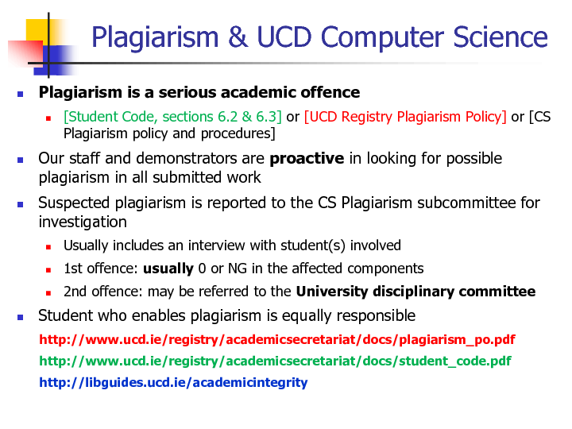

# 学术诚信说明

## 提醒
>根据《北京工业大学学生违纪处分办法》：
第四十四条 有下列情形之一的，为考核作弊行为，给予记过处分；情节严重的，给予留校察看处分。
（二） 抄袭、协助他人抄袭试题答案或者与考试科目内容相关的资料的，或者在结课考查中抄袭的；

本仓库积极配合学校/学院对作弊的任何怀疑和指控，并积极提供各类证据。

请充分了解Plagiarism的含义，谨防潜在的Plagiarism行为。

## ⚠️ 重要声明

本知识库旨在为 BDIC 软件工程专业学生提供**学习辅助与经验分享**，帮助大家更好地理解课程内容、规划学习路径。

!!! danger "零容忍政策"

    对以下学术不端行为采取**零容忍**态度：
    
    - **直接抄袭**：复制本仓库内容用于课程作业、实验报告或考试
    - **变相抄袭**：仅修改变量名、格式后提交为个人作业
    - **学术造假**：使用本知识库参与任何形式的学术不端行为

### 学术不端行为

!!! danger "绝对禁止"

    ❌ 直接复制代码或报告提交为作业  
    ❌ 在考试中参考本仓库内容  
    ❌ 为他人代写作业或项目  
    ❌ 将内容用于商业用途  

### 违规后果

违反学术诚信的后果包括但不限于：

- **课程处分**：成绩取消（F/NG）、学术警告
- **严重后果**：退学处理、影响升学就业
- **法律风险**：知识产权侵权、法律诉讼

## 监督措施

为维护学术诚信，我们采取以下措施：

1. **技术检测**：使用代码相似度检测工具
2. **校方合作**：配合学校学术诚信调查  
3. **举报机制**：接受社区监督和举报
4. **记录追踪**：保留向教学委员会报告的权利

---

如有疑问，请联系：`bdicfun@gmail.com`